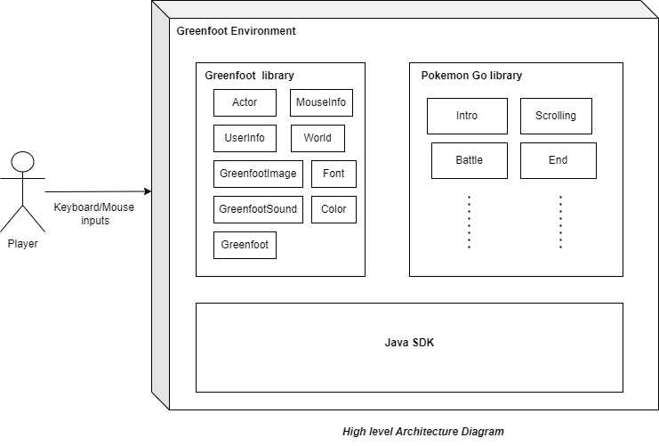
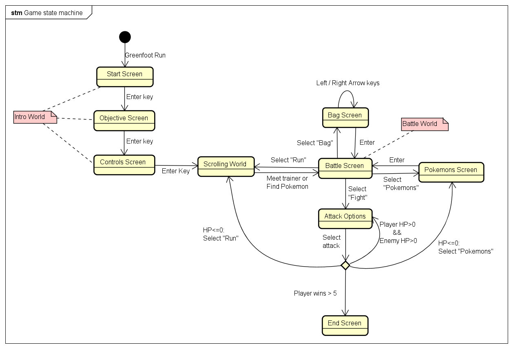
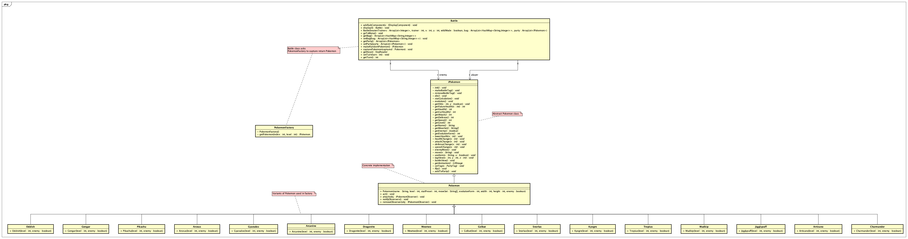
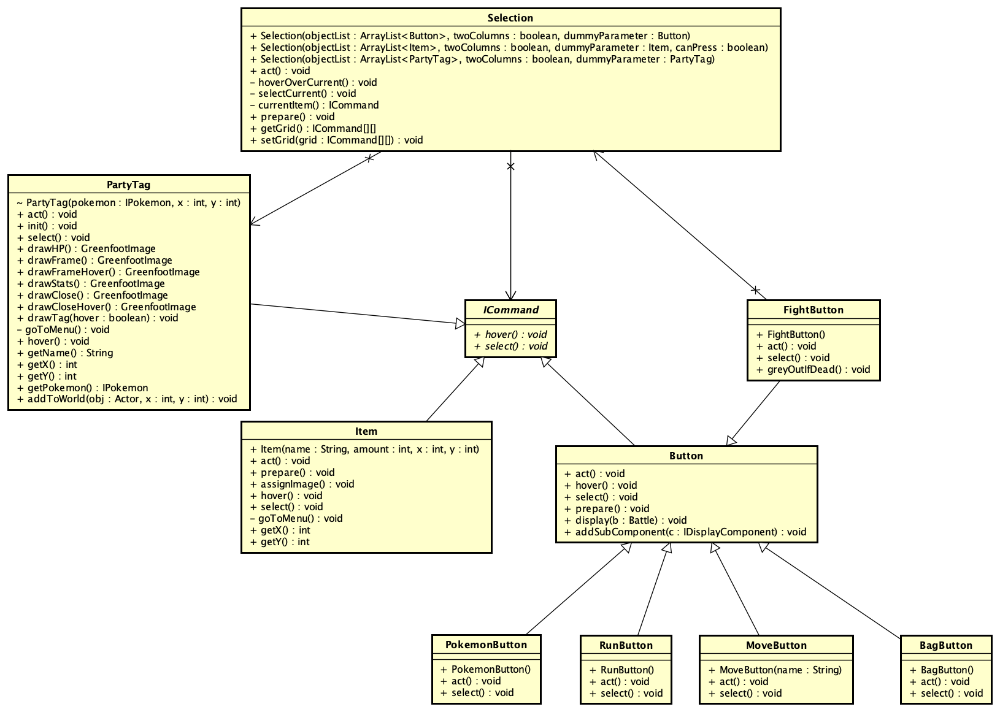
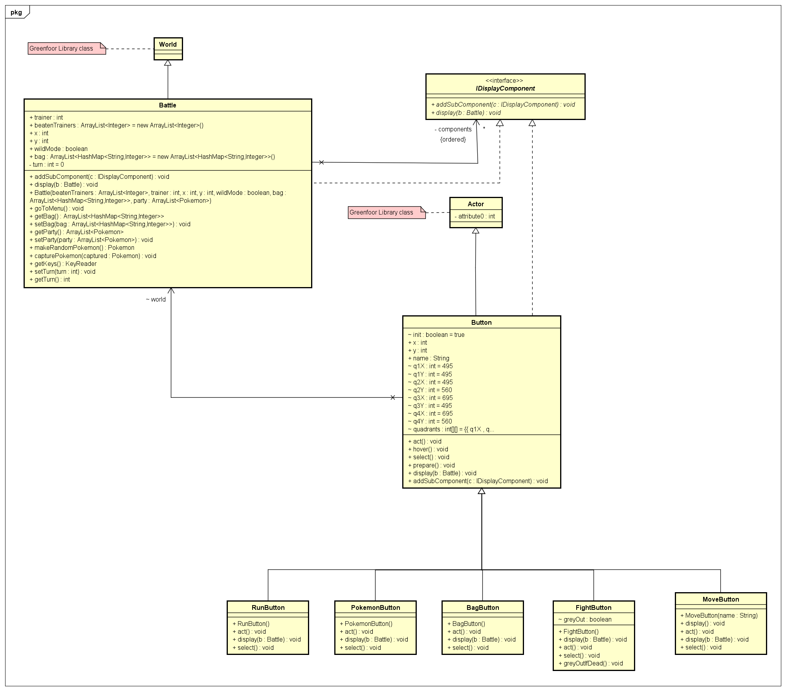
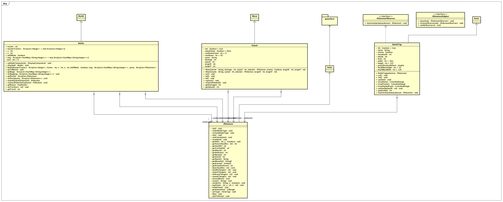

## Best Team

### GOAL:

To learn and implement design patterns in an application.

Contributions:

* Indranil: Factory pattern for selecting the opponent Pokemon
    - [Journal](journals/indranil.md)
* Abhishek: Command pattern for selecting the moves, party Pokemon and bag items
    - [Journal](journals/abhishek.md)
* Sushmitha: composite pattern to display the buttons on battle screen
    - [Journal](journals/sushmitha.md)
* Sai: Observer Pattern for tracking the Pokemon HP, video
    - [Journal](journals/sai.md)

### Link to the game video

[Project Spiel - User Story](https://www.youtube.com/watch?v=PAGUXUL7cts)

### Project Description

We have made a game of Pokemon where the player can move around in the Pokemon world and fight with the wild Pokemon and the trainers with other pokemon.

* We have implemented the game in Greenfoot. User have the option to move around in the bushes and find a Pokemon to fight.
* Defeating the Pokemon adds to the experience of the Pokemon.
* Increase in exp leads to increase in the level and after a certain level the Pokemon evolves into its next stage.
* In the game, the user can battle with 5 trainers spread over the game and fight with them. Beating all 5 wins the game for the user.
### High level Architecture Diagram

### Game State Diagram

### Class diagram

**Factory patterns**:

The Factory pattern is a creational pattern where we create object without exposing the creation logic to the client and refer to newly created object using a common interface.

* The `IPokemon` abstract class is the one which defines the interface which is to be exposed to the users of the classes.
* The `Pokemon` class inherits the `IPokemon` class and has a concrete implementation of the `IPokemon` interfact.
* The other Pokemon classes such as `Arcanine`, `Arceus`, etc provide variants which need to be instantiated in the `Battle` world.
* The `Battle` world has an object of the `PokemonFactory` class which is used to return instances of the Pokemon variants by using the `getPokemon` function.

**Command pattern**:

Command is a behavioral design pattern that turns a request into a stand-alone object that contains all information about the request. This transformation lets you pass requests as a method arguments, delay or queue a request’s execution, and support undoable operations.

* The `ICommand` class in the abstract class which is extended by all the button required on the battle screen.
* `Selection` class creates an instance of `ICommand` class and calls the show and hover method of the related class as per the command type.
* `PartyTag` and `Fight` are the other command which use the command pattern in the game in the same way as the attack commands

**Composite pattern**:

Composite is a structural design pattern that lets you compose objects into tree structures and then work with these structures as if they were individual objects.
We have applied composite pattern to display option buttons on battle screen.

**Observer pattern**:

Observer is a behavioral design pattern that lets you define a subscription mechanism to notify multiple objects about any events that happen to the object they’re observing. Observer Pattern is implemented to observe the health and level values for the pokemon class. Pokemon is the subject and BattleTag class is the observer.

